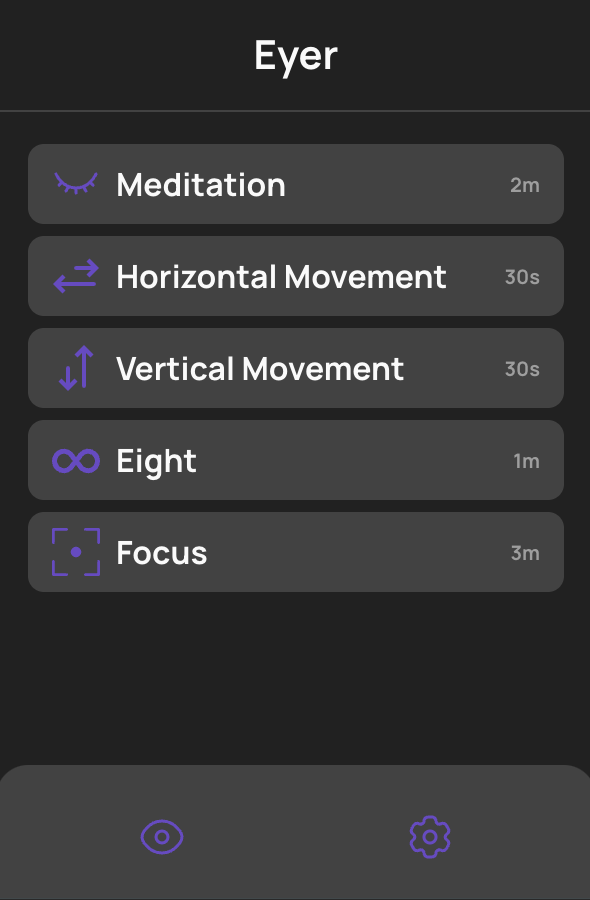

# Eyer

Eyer is a Chrome plugin that offers several eye exercises and sends notifications to remind you to take breaks. It helps reduce eye strain during long hours of computer work.

## Available Scripts

In the project directory, you can run:

### `npm run build`

Builds the extension for production to the `build` folder.\
It correctly bundles React in production mode and optimizes the build for the best performance.

The build is minified and the filenames include the hashes.\
Your extension is ready to be deployed!

See the section about [deployment](https://facebook.github.io/create-react-app/docs/deployment) for more information.

## Learn More

You can learn more in the [Create React App documentation](https://facebook.github.io/create-react-app/docs/getting-started).
[Chrome extension documentation](https://developer.chrome.com/docs/extensions)

To learn React, check out the [React documentation](https://reactjs.org/).
